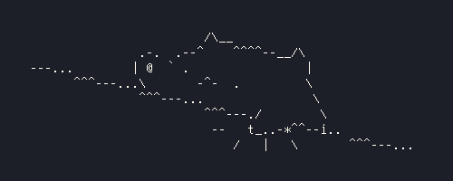

# Command-Line Bongo Cat

An animated bongo cat which responds to keypresses as you type, from the comfort of your own terminal. Perfect for distracting you while typing reports and coding.

## Installation

### Dependencies

Requires:

 - Xlib
 - Xutils
 - NCurses

Note that this will work on Wayland. It is kinda broken on GNOME though due to the way it handles virtual desktops. I'm not currently working on it because I'm lazy. Feel free to fork and fix if you'd like.

### Simple install

Move `bongocat` to your PATH

### Build

 1. Clone into this repository
 2. run `make`
 3. move the binary to your PATH

## Usage

### Run

Just run `bongocat`

### Config

Put the file `config` into the directory `$HOME/.config/bongocat/`

Read the config file for more information.

## (Known) Bugs

 - The binary may not work on OpenSUSE. If this is the case, please try compiling from source

## Things to come

 - multicolour
 - more ascii art options/config
 - cleaning up the awful source code

## Credits

 - [StrayRogue](https://twitter.com/StrayRogue) for their original drawing of bongo cat
 - [This](https://stackoverflow.com/questions/22749444/listening-to-keyboard-events-without-consuming-them-in-x11-keyboard-hooking) StackOverflow answer
